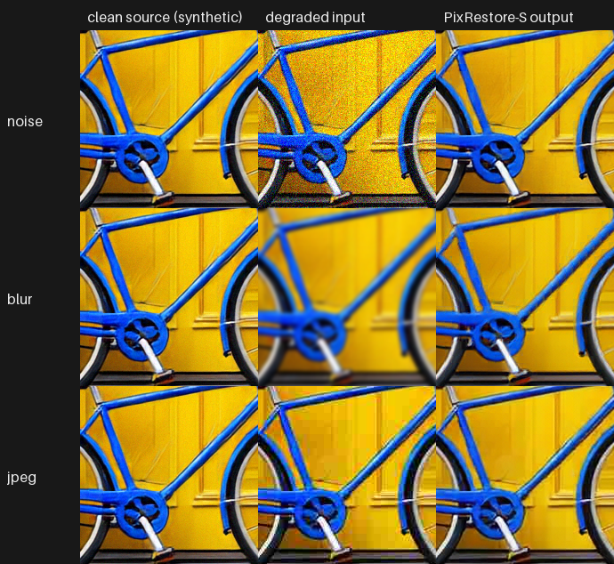
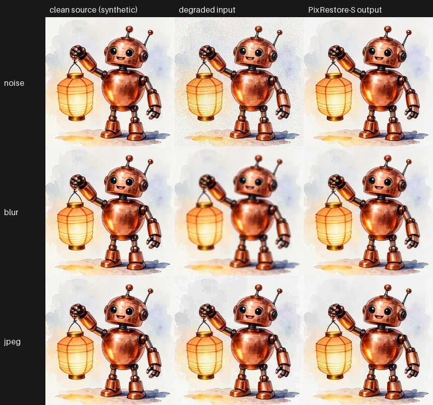

# PixRestore for ComfyUI

Unofficial ComfyUI nodes for **PixRestore-S**, the released one-step model of
[PixRestore: Unified Image Restoration via Pixel Diffusion Transformer](https://github.com/csslc/PixRestore)
(Sun et al., arXiv:2608.16793). It restores noisy, blurred or JPEG-compressed **512x512 RGB** images with one
denoiser call, conditioned on DINOv2 features.

- Standard ComfyUI `IMAGE` in and out; Loader / Restore / Unload nodes.
- The official one-step path is reproduced **bit-exactly**: on the RTX 5090 test machine the node's 8-bit output and
  the recorded intermediate tensors (input, noise, six DINOv2 layers, model output, final float) equal the unmodified
  official `inference.py` run in eager mode, for all 16 test images
  (12 demo inputs + 4 center-crop cases), also from a clean install. Details: [docs/VERIFICATION.md](docs/VERIFICATION.md).
- No upstream code or weights are shipped here. A setup script downloads the released files at fixed revisions and checks
  each file's SHA-256; the nodes never download anything.

> Restoration with this model is **generative**. It removes the degradation and can also invent or change fine
> details (texture, thin lines). The output is a plausible image, not a recovery of the true original.



*200x200 pixels at 1:1 from one demo image. Rows: Gaussian noise (sigma 25/255), Gaussian blur (radius 2), JPEG quality 15.
The clean source is itself a synthetic image (see [Demo](#demo)).*

## Install

Status: v0.1.0 pre-release, tested on Windows 11 + RTX 5090 with ComfyUI v0.38.0 (CUDA GPU required).

1. Clone into `ComfyUI/custom_nodes` and install the one extra dependency with **ComfyUI's Python**:

   ```
   cd ComfyUI/custom_nodes
   git clone https://github.com/hiroki-abe-58/ComfyUI-PixRestore
   python -m pip install -r ComfyUI-PixRestore/requirements.txt      # timm>=0.9,<1.1
   ```

2. Download the model files (about 0.22 GB) into `ComfyUI/models/pixrestore`:

   ```
   python ComfyUI-PixRestore/tools/setup_pixrestore.py --models-dir ../models
   ```

   It fetches PixRestore-S `config.json` + EMA weights (Hugging Face, revision `a5fe719`), DINOv2 ViT-S/14 weights,
   and 25 unmodified source files of PixRestore (`909ca06`) and DINOv2 (`7764ea0`), and verifies all of them.

3. Restart ComfyUI. Open `workflows/gui/pixrestore_restore.json`. To try it, copy
   `workflows/input/pixrestore_sample_512_jpeg.png` into `ComfyUI/input`.

## Nodes

| node | what it does |
|---|---|
| **PixRestore Loader** | Loads `pixrestore-s` and DINOv2 ViT-S/14 from `models/pixrestore`, checks the SHA-256 of the released files (on by default). One model stays resident. |
| **PixRestore Restore (512x512, 1 step)** | `image` -> restored `image` + JSON `report` (seed, hashes, timings). `seed` (default 0, kept fixed) changes the result. `preprocess`: **exact 512x512** (other sizes are refused) or **center crop to 512** = the official `--test-mode center_crop` (short side resized to 512 with bicubic, centre 512x512 kept; the output is that 512x512 crop). A batch is processed one image at a time with `seed + index`, like the official script on a folder. |
| **PixRestore Unload** | Frees the model (GPU and RAM). |

Fixed in v0.1.0: one step, CFG 1.0, bf16 autocast as in the released config, eager PyTorch (no Triton).

## How it matches the official code

- The node imports the pinned upstream `pixrestore` and `dinov2` packages from `models/pixrestore/upstream` after checking
  every file's hash, builds the model exactly like `inference.py` (released `config.json`, strict weight loading) and
  calls the upstream `extract_layers` and `sample_multistep_fm(n_steps=1)`.
- Upstream decorates several functions with `@torch.compile`, which needs Triton (not available by default on Windows).
  The node uses the undecorated functions; this equals running the official script with `TORCHDYNAMO_DISABLE=1`.
  The as-written compiled path gives slightly different pixels: on the 12 demo inputs 11 % of 8-bit values differ,
  by at most 5/255 (mean 0.11/255). Both are reported in [docs/VERIFICATION.md](docs/VERIFICATION.md).
- Seeding uses this GPU's generator inside `torch.random.fork_rng`; the official TF32 / SDPA / reduced-precision
  settings apply only during the call (ComfyUI changes one of them globally) and are restored afterwards.

## Measurements

RTX 5090, Windows 11, ComfyUI v0.38.0, one image per prompt, sequential (not a benchmark):
first prompt 3.7 s including loading; afterwards about 0.11 s per prompt (median of 11), of which about 0.045 s on the
GPU; peak CUDA memory allocated by the node 342 MiB; ComfyUI process at most 5.3 GiB private memory with the model loaded.

## Demo

4 clean images x 3 degradations = 12 restorations, **all of them shown** in `docs/images/grid_*.png` (rows: noise, blur,
JPEG; columns: clean source, degraded input, output; downscaled to 256 px per cell). Full-size files are in the
release asset `demo_images_v0.1.0.zip`.



*One of the four grids, chosen by the author. The others: [p0](docs/images/grid_p0_s7_l4.png),
[p1](docs/images/grid_p1_s7_l4.png), [p2](docs/images/grid_p2_s7_l4.png).*

- Clean sources: four of the author's own Looped-DiT generations (synthetic images, picked by a fixed rule before
  any restoration ran). Degradations: fixed and documented in [docs/results/demo_manifest.json](docs/results/demo_manifest.json).
- PSNR against the clean source (full 512x512, RGB, 8-bit, no crop or shift), input -> output:
  noise 20.7-21.4 -> 29.7-32.4 dB, blur 23.1-29.5 -> 25.4-30.7 dB, JPEG 26.2-30.6 -> 26.9-30.9 dB.
  PSNR rose in all 12 cases (by 0.3-0.8 dB for JPEG). Per-image values: [docs/results/demo_metrics.json](docs/results/demo_metrics.json).
- What you can see in the grids: the noise is removed together with fine paper/brush texture; blurred edges come back
  sharp with re-synthesised detail (spokes, lantern ribs) that is similar to, not identical with, the source.
- 12 synthetic examples say nothing general about restoration quality. An upstream issue (#3, opened by a user) is
  titled "实测效果很差" ("poor results in practice"); this repository did not evaluate that. Judge on your own images.

## Limitations

- CUDA GPU only (tested: RTX 5090 on Windows). No CPU or Apple MPS mode.
- 512x512 only; larger or smaller images must be cropped/resized (or use the official center crop). No tiling.
- PixRestore-S only (not B / L / XL); one step; CFG 1.0.
- The model stays outside ComfyUI's model manager; use the Unload node to free it.
- The node imports upstream modules named `pixrestore` and `dinov2`; if another custom node already loaded a different
  module with one of these names, loading is refused with a message.

## License and credits

This repository: MIT (see [LICENSE](LICENSE)). It contains no third-party code or weights; what the setup script
downloads and under which terms is listed in [NOTICE](NOTICE). In short: PixRestore's README states Apache 2.0 (its
LICENSE file is missing at the pinned commit, and some files say they were adapted from DiT, LightningDiT, SiT, EVA-02
and DINOv2); the Hugging Face model card states apache-2.0; DINOv2 code and weights are Apache 2.0. Check the upstream
terms for your use. Please cite the PixRestore paper if you use the model.

Japanese summary / 日本語の概要: [README.ja.md](README.ja.md)
